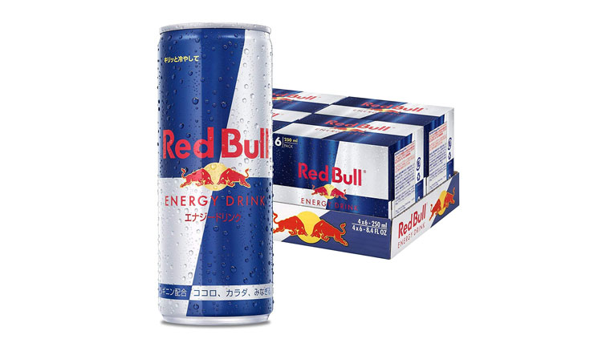
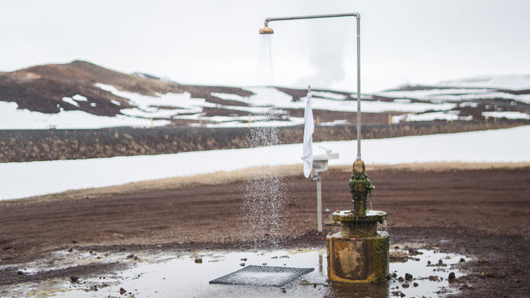
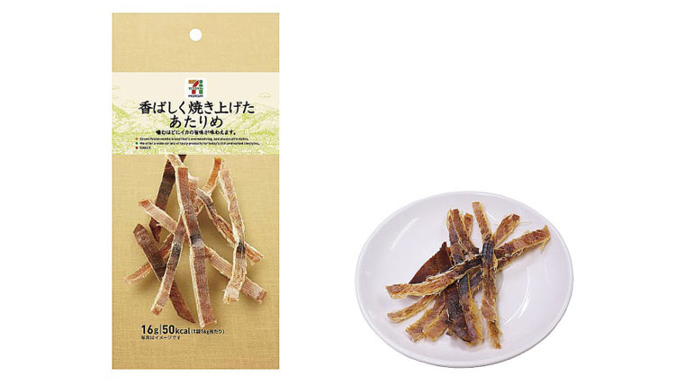
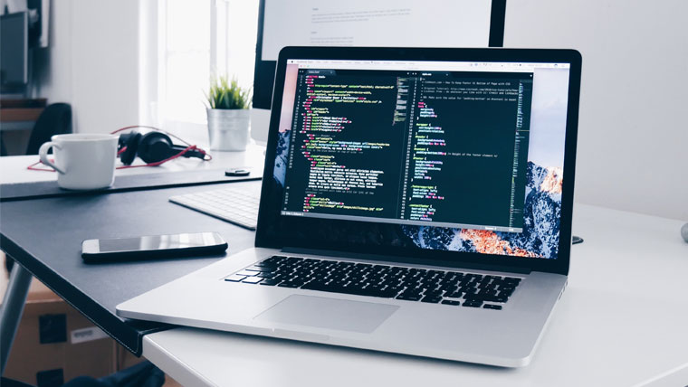

朝起きたらなんにもやる気が出ない。せっかくの休日に勉強でもやろうと思ったけどなーんかやる気しない。眠くなる。

そんな時に効果的にやる気を出す方法を紹介していこうと思います。

## コーヒーやエナジードリンク(レッドブルなど)を飲む

鉄板ですが、最初に紹介する方法はカフェインを多く含んでいる飲料を摂取することです。ただ、これはやりすぎると身体に耐性ができてしまい段々と効き目が薄くなってくる他、過剰摂取で身体に悪影響を及ぼすこともあるので注意が必要です。

## シャワーを浴びる

ずっと作業を続けていたり読書していると自然と瞼が落ちそうになってきますよね？

そんな時は一旦手を止めて熱いシャワーを浴びると一気に眠気が覚めて効果抜群です。

お昼の中途半端に時間にシャワーを浴びたりすることに抵抗感がある人もいますが、なんとか眠気を抑えたい人は遠慮せずお風呂場へ行きましょう。

しかし、お風呂上がりは割と頭が落ち着くので、その勢いで「ちょっとだけ休憩してから…」なんて甘えたことをしてはいけません。

すぐに作業に戻りましょう。

でなければその日一日あなたは一切の作業に手がつかなくなります。

## 硬いものを食べる

やる気の出ないときにご飯を食べてしまうと身体が満足して逆効果だと思われますが、効果のある食べ物もあるのです。

それが、スルメや昆布などの硬い食べ物です。

硬い食べ物って噛んでもなかなか飲み込めないですよね？　噛むという行為にはそれだけである程度食欲を満たす効果があるんです。

食欲は睡眠欲と同じ三大欲求です。

作業をしながら、とりあえずくちゃくちゃとスルメを噛んでいれば不思議と眠たくならないんですよこれが！

歯ごたえが眠気を相殺してくれているような感覚を味わえます。

セブンイレブンやスーバーでも100円ぐらいで買えるので、一度試してみてください。

## 憧れている人の本、動画、作品などをみる。

今あなたは人生の目標となる人はいるでしょうか？ もし憧れの人、目標としている人が一人でもいるならばその人の著作の本や投稿している動画。イラスト系であれば好きなイラストをじーっと見つめてみてください。

生きる上で自分よりも上にいて、かつそれが自分の将来立ちたい目標にいる人であるならば、その人がどれだけの苦労を重ねて今の位置に立っているのか想像なんてできないと思います。

そして、自分が同じ高みに至るためには今ここで休んでいる場合じゃないと自分で自分に喝を入れるでしょう。

これは結構おすすめです。特に動画系であれば耳だけ聞いて実際に作業の手を動かすこともできます。

一度、YouTube で好きな内容で検索してみてください。

ただ動画漁りに夢中になって本題を忘れないように。

## 一旦別の作業に取り掛かる

今一番やりたいことに集中できない時は思い切って手を止めて別の作業に着手するのもいいですよ。

人間の集中力なんてもって30分〜60分と言われているので、無理して一つの作業ばっかりするのも非効率です。

例えば、1時間刻みでやる内容を変えてみることから実践してみてはどうでしょう？

## 仕事を休む

思い切って仕事なんて休んじゃいましょう。

大丈夫、1日ぐらい休んだって誰も迷惑しません。

というか、ちょっと休んだぐらいでぶーぶー言う会社なんている価値ないのでさっさと辞めてしまったほうがいいです。

1日仕事を休んだら最低でも8時間は自由時間が生まれます。あとはその時間でのんびり自分の作業を進めましょう。

案外、そこから新しい発見が見つかるかもしれませんよ？

## 無理なものは無理。諦めて寝る！

下手な考え休むに似たり。どうせ集中できないなら無駄なことはやめてさっさと仮眠でもしてしまいましょう。

眠たい目を擦らせながら作業をしてもいい成果なんて出るわけがありません。

集中できるときに思いっきり作業をする。そのために集中できない時はさっさと休む。

これでも一つの戦略です。

以上です

使えないような内容はありましたでしょうか？

人間、いつだってやる気の出る時、出ない時の浮き沈みはあります。けれどその中でもきっちりとした成果を上げるにはやっぱりなんとかして手を動かしていくしかありません。

そのために、この記事があなたの一助となることを願っています。
