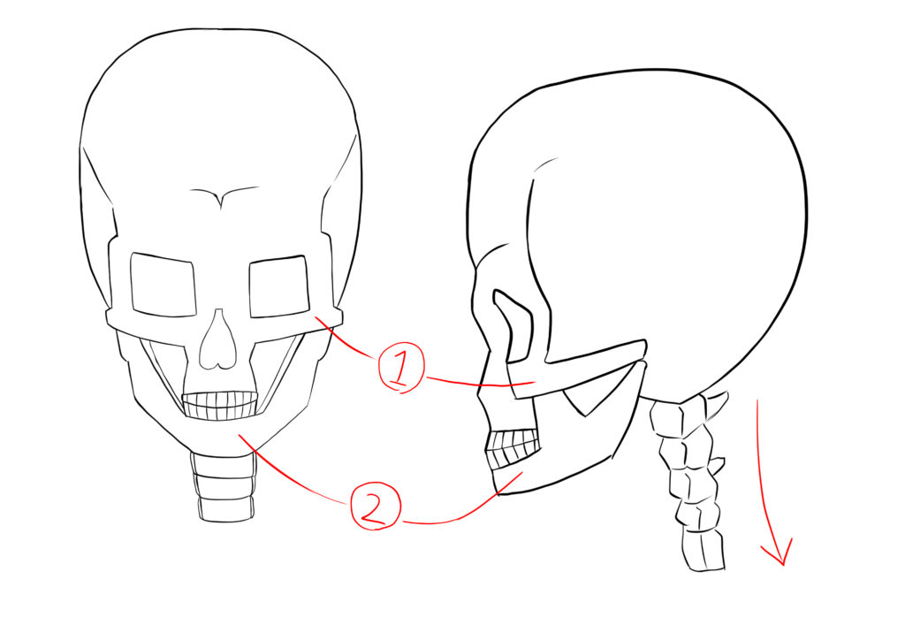
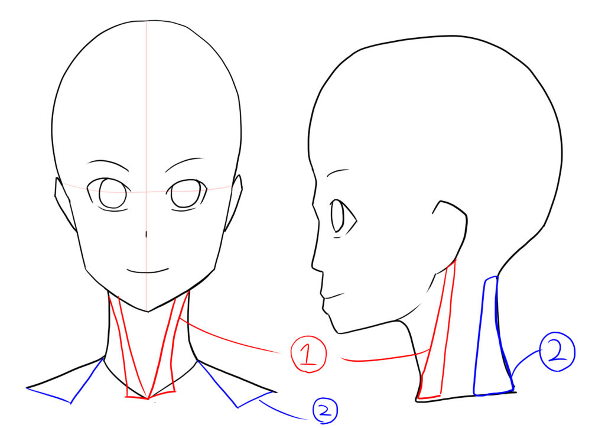
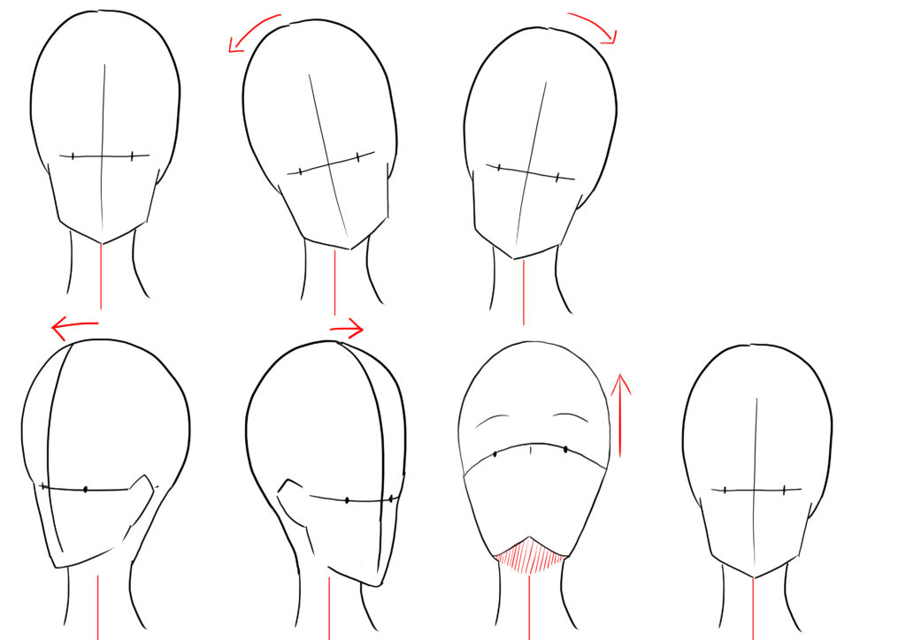

今回はイラストの練習の一環で頭蓋骨と筋肉周りの構造と主要な箇所をイラストを添えてお送りしていきます。

イラストにおいて顔は一番重要なパーツなので、ここら辺はしっかりと基礎知識を理解しておきましょう。

## 頭の骨と筋肉

1.   頬骨（きょうこつ）
2.   下顎骨（かがくこつ）

顔の頭蓋骨は、顔と鼻の箇所が空洞になっており大きく動く顎骨で高さが大きく変わります。

イラスト描く上で骨の名称などはそこまでしっかりと覚える必要はないかもしれませんが、上の頰骨と下顎骨は皮膚の上からでも分かる部位なので意識しておいた方がいいかもしれません。

### 首の角度

首の骨格を見ていると、結構後ろに沿っているのが分かると思います。

首は正面から見ると顔からまっすぐ上半身につながっているようにし見えますが、横から見ると実は背中に向かって若干斜めっているんです。

これは筋肉をつけた場合でも同じ（詳しくは下のイラスト参照）なので、意識して角度を調整しましょう。

## 首の筋肉

1.   胸鎖乳突筋（きょうさにゅうとつきん）
2.   僧帽筋（僧帽筋）

首の筋肉は主に上の**２種類**。僧帽筋は首と同時に肩を動かす筋肉でもあります。

### 頭の動きかた

首は上下左右に動きます。

実際に首を動かすとよく分かるのですが、人間は首を振る時には同時に身体も捻ります。

なので結構よく回るように感じますが、実は首だけ回す場合は30度程度しか回りません。身体を固定して首を動かしても真横すらしっかりと見れないんです。

下に大体の首の回った状態のイラストを載せていますので、参考になれば幸いです。

### 正面から見た首の周り方

*  首は後頭部と繋がっている。
*  上を向くと顎から首までの線が繋がる。

### 側面から見た首の周り方

* 真横から見ると、眼は綺麗な円形にはならない。
* 眼と耳のラインは真っ直ぐに繋がる。
* 横から見ると鼻は出っ張っている為、顔の角度によっては瞳が鼻に隠れる。
* 俯くと、顎から首に繋がる筋肉が見えなくなる。
