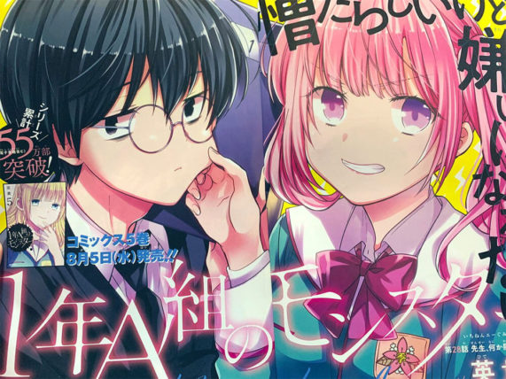
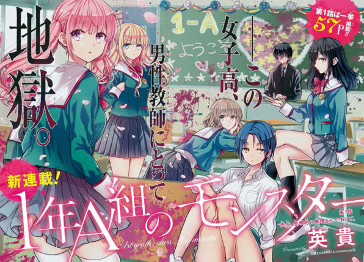

**この記事を開いた方へ**

あなたは女子校という存在について、どういう認識を持っているでしょうか？

*   華やか
*   女子の花園
*   きらびやかな女子がたくさんいる
*   エロい

パッと思いついたところだと、こんなイメージがあるかもしれない。

よろしい。

それでは

**その幻想をぶち殺す！**

というわけで、今回はコミックREXで連載中の『**1年A組のモンスター**』という作品を紹介します。

今回の記事は下記点をピックアップして紹介します

*   1年A組のモンスターってどんな物語？
*   どんなキャラクターが出てくるの？
*   誰におすすめ？
*   無料の試し読みとかある？

『1年A組のモンスター』とは？
---------------

作者：英貴

> _1年A組は「地獄」だと誰かが言った――。  
> __担任がすぐ辞める問題児揃いのクラスに赴任してきた教師・自見太郎。地味で存在感はないが、異常なほどの真面目さで 女子校生たちを教育していく――。_
>
> [_https://comic.pixiv.net/works/6480_](https://comic.pixiv.net/works/6480)

主人公はヒロインの在籍する女子校に赴任してきた教師、『_自見太郎』_。

自見先生が担任をする学年、1年A組はお金持ちやアイドル等が数多くおり、傲慢、言うことを聞かない、平気で先生に反抗するといった問題児が多くします。

こういった環境の所為で、自見先生の前にも幾数人の教師がおりましたが精神的に耐えかね、辞めていきました。

自見先生はこのモンスターが蔓延るA組の担任になることを命じられ、第1話が始まります。

どんなキャラクターが出てくるの？
----------------

この項ではメインに登場する主人公とヒロインを紹介します。

（左：主人公　右：ヒロイン）

### 主人公：自見太郎（じみ たろう）

*   地味
*   メガネ
*   陰キャ
*   童貞
*   コミュ障

自見先生のビジュアルは（まるでお前らのような）典型的な陰キャラ男です。

少女漫画に登場するようなイケメン主人公とは180度方向性が異なります。

作中で彼は自分のクラスの生徒に授業中に私語で妨害、頭からジュースをぶっ掛けられる等、ものによってはシャレにならない嫌がらせを受けます。

ですが、自見先生はそれに対して一切怒ったりせず、淡々と生徒に注意、場合によっては個別で指導を行っていきます。とにかくめっちゃ精神力強いのがこの主人公の特徴です。

最初はいじめて退職に追い込んでやろうと画策するクラスの生徒も、次第にこの強メンタルを持つ自見先生に根負けします。

そのメンタルの強さは生徒相手以外にも発揮します。

特に仕事の就業時間。

#### 定時に絶対帰るマン

この主人公、定時の概念に非常に厳しく、定時を過ぎると一切仕事をしません。

生徒に対しても仕事中は優しい先生として接しますが、定時後は一点して冷めた態度で相談に訪れても冷たく突き放します。

このあたり割と教師としてどうなの？って部分はありますが、作中でもそれは言われていますが自見先生は一切気にしません。

ある意味無敵の人です。

**「定時ですので」**は自見先生の名言。

残業をしない件について学年主任に咎められても絶対に自分の信念を曲げません。

生徒であろうと他の先生であろうと、自身のプライベートに一切干渉させません。

なので主人公であるにも関わらず、作中で一番謎の多い人物になっています。

この主人公のルーツを辿っていくのも、この漫画の面白いところの一つです。

また、女生徒の裸を見ても一切動揺しません。

クラスメイトの一人（というかヒロイン…）が下着姿で迫って先生をハメて辞職に追い込もうとするんですが、自見先生はなんと逆に自分からズボンを下ろして人を呼ぶというキテレツな行動をとったります（笑）。

この行動がどうなったかは是非漫画を読んで確かめてください。

**面白いんで。**

### ヒロイン：花中 桃（はななか もも）

*   モデル
*   ツインテール
*   ツンデレ（ツン9割）
*   巨乳
*   ピンク髪（ピンクは淫ら…）
*   ワガママ

顔が小さい、胸が大きい、肌ツヤがキレイ、まつげ長い、何着ても似合う作中で人気Noのモデルのヒロイン（JKがなりたい顔No1）

だがしかし、その実態はわがまま放題で自身の影響力を盾にし、教師を何度も辞めさせたというモンスタースチューデントです。

**美人は性格悪い。の見本みたいな女。**

当然、赴任してきた自見先生にも数々の嫌がらせを行います。

頭からジュースぶっ掛けたり、クラスメイトと全員の前で童貞がどうかを質問したり…。

ですが自見先生の紹介文であったとおり、自見先生はそんなものでへこたれるほどやわな精神力ではありません。

何をしてもひるまない自見先生の態度に、ついに桃は色仕掛けで自見先生をハメようとするんです。

……。

この時いろいろあり（くわしくは漫画読んでね！）、結果として自見先生を辞めさせることには失敗した桃ですが、その時の行動を一部のクラスメイトに見られておりました。

#### 立場逆転

そして、事実を脚色され、桃は今まで散々嫌がらせした地味先生（誤字にあらず）に恋愛がらみで迫ったとクラス中にバラされます。

この件で桃は半ば裏切り者のような扱いでクラスから孤立することになり、これまでは他のクラスメイトと一緒になって他者を陥れる側にいたはずが、逆に陥れられる側に回ってしまいます。

要するにいじめにターゲットになってしまうんですね。

桃は自見先生と違い反抗心が強い人間なので、当然クラスメイトを糾弾します。

が、さすがに多勢に無勢で彼女はどうすることもできず、次第に心が弱っていくんです。

ですが、自分がいじめられる側に周り、過去に自分のした行いを自分の身で受けたことで桃の心境にも変化が訪れます。

**その気持ちの変化は一巻の最終話で大きな形で花開くことになります。**

#### ラブコメ要素

自見太郎に対しては一貫して

**キモい**  
**童貞ネガネ**  
**あいつを好きになるとかありえない。**

と基本的には否定的な言葉を出しています。

しかし困った時やイライラしている時等、感情が安定していない時はほぼほぼ必ず自見先生のところへ飛んでいき暴言吐いたり、キックかましたりとなにかかまってほしそうな態度をとったりもします。

現状はほぼほぼデレないツンデレみたいな状態ですが、話に進むに連れ徐々に棘もなくなっていきデレ成分が多くなっていくかもしれませんので、それも今後の見どころ！！

早くデレろー！　いやデレてくださいお願いします！

『1年A組のモンスター』は誰におすすめ？
--------------------

メインヒロインの桃がツンデレ気質なので、ツンデレが好きな人には絶対的におすすめです！

別作品になりますが、僕は下のヒロインが大好きです。

*   とある魔術の禁書目録の『御坂美琴』
*   Fate/staynightの『遠坂凛』
*   冴えない彼女の育てかた『澤村・スペンサー・英梨々』

今作品のヒロインは上記のキャラクター性と一部似通ったところがあるので、上のキャラが好きな人は絶対に気に入ります。断言します。

『1年A組のモンスター』をおすすめしない人
---------------------

過去にリアルいじめにあってまだトラウマが残ってる人にはあまりおすすめしません…。

物語序盤ですが、割とガチないじめ描写があるので、そういったものに嫌悪感がある人は読まないほうがいいかもしれません。（特に女性）

いじめ自体は物語の中核ではないので、2巻、3巻と続くに連れ要素は薄くなっていくのでそこまで気にしないという人であればぜんぜん大丈夫です！

物語はラブコメ＋学園ヒエラルキーが主軸のシリアス
------------------------

絵柄は萌系のイラストですが、ストーリーはエグいです。  
（殺人未遂とかします）

単純な可愛い女の子を見ていて癒やされる系の漫画ではなく、学園内のリアルなヒエラルキーがあるシリアスな展開があります。

女子生徒同士の華やかな交流の裏側で、各々が悩み、考えながら生活していく物語です。

自見先生はそんなまだ精神が不安定な年頃の生徒を（**嫌々**）導き、（**定時まで**）更生の為に一緒に尽力します。

無料で試し読みとかある？
------------

Pixivで1話が無料掲載されているので、そこから試し読みできます。

 https://comic.pixiv.net/works/6480

](https://comic.pixiv.net/works/6480)

[1年A組のモンスター: 1 (REXコミックス)](https://www.amazon.co.jp/dp/B07DXNS7VG?tag=kenji193-22&linkCode=ogi&th=1&psc=1)

*   [Kindle](https://www.amazon.co.jp/dp/B07DXNS7VG?tag=kenji193-22&linkCode=ogi&th=1&psc=1)
*   [Amazon](https://www.amazon.co.jp/dp/B07DXNS7VG?tag=kenji193-22&linkCode=ogi&th=1&psc=1)
*   [楽天市場](https://item.rakuten.co.jp/rakutenkobo-ebooks/acf0b108ed9b3fe3aca57ef31771a64d/)
