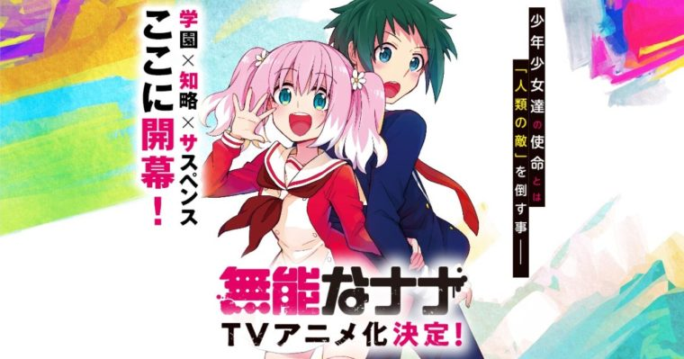

**「人類のために、死んでください」**

これは、**“人類の敵”**と称される謎の怪物を相手に異能力に目覚めた主人公と能力者達によるストーリーです。

今回は、アニメ化（2020年10月放送）も決定した『無能なナナ』について紹介していこうと思います。

現在も月刊少年ガンガンで絶賛連載中であり、単行本も6巻まで発売されています。

漫画原作で絶賛連載中を追いかけ、単行本も全巻（記事作成時：既刊６巻）をすべて購入、読破し絶賛している僕が作品の魅力を語らせてもらいます。

未読の方向けに漫画の内容が伝わりやすいよう、下記をピックアップして紹介していきます。  
既読の方もおさらいの意味をふくめてみていただければ幸いです。

*   無能なナナとは？
*   登場人物＆世界観について知りたい。
*   ラブコメの要素

無能なナナとは？
--------

作者：るーすぼーい  
作画：古屋庵

作者である『るーるぼーい氏』は今作とは別に「**G戦場の魔王**」や「**車輪の国　向日葵の少女**」という名作を生み出した実績あるシナリオライターです。

当然、上記２作共、僕はプレイ済です。  
『無能なナナ』は作者と過去作品と比較しても決して引けをとらない非常に高いクオリティの漫画になっています。

### あらすじ

> 絶海の孤島にある学園。そこでは人類の敵に対抗すべく、若き能力者達が訓練に明け暮れていた。  
> そして転校生の主人公も同様に「人類の敵抹殺」を胸に、行動を開始する…。  
> 想像をことごとく裏切る、正義と悪の知略サスペンス開幕!!
>
> 出展：[ガンガンオンライン](https://www.ganganonline.com/contents/munou/)

### 作中の舞台

メインのフィールドは絶海の孤島にある学園。

教育機関を名乗っていますが、この学園は**“人類の敵”**を倒すための人材を教育する訓練施設です。

『無能なナナ』の世界では、およそ100年前に**“人類の敵”**と呼ばれる怪物が登場しました。

**“人類の敵”**が人を襲い、人類は大量の死者を生みだし、名の通り人類の危機をおこします。

その危機事態に対し、人類サイドも異能と呼ばれる特殊能力が使える異能力者を生み出し、『人類の危機』に対抗。

結果的に、人類はこの怪物を撃退することに成功し、人類絶滅の危機を脱することができました。

しかし、この**“人類の敵”**は一匹ではありません。

100年後の未来である現代にも、直接表舞台には登場しませんがこの**“人類の敵”**は存在しており、密かに人を殺害しつづけています。

異能力を持てない通常の人間では、この怪物に対し圧倒的に武力で劣り、直接退治すると多数の死者を出してします。

なので、**“人類の敵”**には強力な異能力を備えた特別な人間を教育、訓練を施し、**“人類の敵”**を倒すため人材を増やしています。

### 異能力は人にとって異なる

今作で登場する能力の異能は、人によってそれぞれ全然違う能力を持っています。  
下記は一例です。

*   傷を癒やす
*   瞬間移動する
*   手から炎を生み出す

### “人類の敵”とは何者？

具体的な正体は不明になっています。

作中でも人の体に獣の顔をした黒い影のようなシルエットが映るのみで、その詳細な姿形はわかりません。

ただ、存在していることは確かです。  
国が主導権を持ち専門の対策チームとして異能を持つ人間を教育していることからも、国家レベルで重大で問題となっています。

メイン登場人物
-------

### 中島ナナオ（なかじま ナナオ）

*   能力者の能力を無効化するという異能の中でも特異な能力持ち（分かりやすく言うと、となる魔術の禁書目録の幻想殺し（イマジンブレイカー））
*   自分の自信がなく気が弱いので、クラスでは友達もおらず孤立気味。
*   転校生のナナと出会い、またとある事情からクラスリーダーになることで徐々に自分似自信を付けていく。
*   ナナに若干好意を持っている節がある。

### 柊ナナ（ひいらぎ ナナ）

*   使える異能は相手の心を読むという能力。
*   ただし自分でオンオフの制御はできない。
*   ピンク髪で短いツインテール
*   天真爛漫で明るく、誰にでも気さくに話せる。
*   若干空気は読めない（自称）

第1話　語り部　中島ナナオ
-------------

メインの語りはナナオで、能力者を育成する学園の中でも自分の能力のパッとしなさや両親との関係等もあり、ナナオは教室でも孤立気味だった。

そこに転校生として2人（うち一人はナナ）の生徒が来たことで、自分と周囲の環境が変化し、ナナオは自分の能力でクラスメイトの諍いを仲裁したりといったことをこなすうち、クラスリーダーに任命され周囲から一目おかれる存在になります。

転校生のナナは、初登場から元気で明るい女の子で、隣の席になったナナオにも初対面で明るく声を掛けてきます。

彼女は能力の都合上、聞きたくない人の心の声が勝手に聞こえたりなどして、それが悩みの種になっていましたがナナオの能力無効化によって（手をつなぐことで）任意で力をカットできるようになり、そのおかげで特にナナオと仲良くなります。

『無能なナナ』のシナリオはシリアス？
------------------

あらすじと紹介文だけでは、かなり重苦しい展開のようになっていますが、漫画の作中で基本的には明るい雰囲気の展開が多いです。

**“人類の敵”**といっても、絶海の孤島は成長前の能力者が怪物に襲われないように人里から若干離れた島であるため、メイングラウンドである島およびが学園に怪物は現れません。

能力者は各々が、生まれつき特別な力を身に着けていた影響で、無能力者に比べると思考回路に若干の差があります。

特に目立つのが、能力を裏付けにする圧倒的な自信や、傲慢さです。

能力者はその力ゆえ、自分は人より優れていると認識してしまいます。

それはいい意味でいえば何事にもポジティブで楽観的なのですが、同時に下記のような特徴も現れます。

*   教師の言うことを無視し、ルールや決まりごとを平気で破る。
*   能力の力で差で他人を見下す
*   自分は絶対に間違えない完璧な人間である。と何の疑いもなく信じている者もいる

こういった人種が一所に集まることで、逆に思考がネガティブなナナオが浮いて目立つようになります。

主にフィーチャーされるのは怪物との対決ではなく、能力者が自分の能力を学び、また自分とは違う異能を持つクラスメイトとの関係を考えたりといった人と人との繋がりや関係性を重視したストーリーです。

アニメ化されるが、漫画も読む価値ありますか？
----------------------

2020年10月（記事執筆時：2020年9月）、アニメの第一話が放送されます。

その前に、漫画で先にシナリオや演出を知ることで、アニメ版と漫画版との違いを比較できて面白いです。

もし漫画が好きな友達がいる場合には話題にネタの一つにもなってくれます。

特に今作は作者が、推理系のシナリオや伏線をはることが非常にうまいるーすぼーい氏なので、漫画版でしかわからない、見れない部分が絶対に出てきます。

アニメだけでも100%楽しめると思いますが、漫画を読むことで150、200%以上に楽しめるので、気になりましたらぜひ一度手にとってみてください。

### 無料で読むことも可能です

ガンガンONLINEで1話、もしくは最新話が無料で読むことが可能です。  
財布の紐を心配する必要なく、漫画を読むことができるのでちょっとでも興味をそそられましたリンク先をチェックしてみてください。

[

無能なナナ

人類の敵を殺せ。人気ゲームシナリオライターが描く新境地!! 「無能なナナ」月刊少年ガンガンより出張掲載! (ガンガンON…

 https://www.ganganonline.com/contents/munou/

](https://www.ganganonline.com/contents/munou/)

### 電子書籍版もあり

amazonおよび、楽天等の電子書籍サービスを利用することで、すぐに単行本を購入、読書ができます。

試し読みで面白かったと感じていただければ単行本の購入も検討いただければと思います。

[無能なナナ 1巻 (デジタル版ガンガンコミックス)](https://www.amazon.co.jp/dp/B01MZF80RW/ref=as_li_ss_tl?&th=1&psc=1&linkCode=ll1&tag=iodein-22&linkId=9df4b5cec34149ea9276fde7d576ddb3&language=ja_JP?tag=kenji193-22&linkCode=as1&creative=6339)

*   [Kindle](https://www.amazon.co.jp/dp/B01MZF80RW/ref=as_li_ss_tl?&th=1&psc=1&linkCode=ll1&tag=iodein-22&linkId=9df4b5cec34149ea9276fde7d576ddb3&language=ja_JP&tag=kenji193-22&index=blended&linkCode=ure&creative=6339)
*   [Amazon](https://www.amazon.co.jp/dp/B01MZF80RW/ref=as_li_ss_tl?&th=1&psc=1&linkCode=ll1&tag=iodein-22&linkId=9df4b5cec34149ea9276fde7d576ddb3&language=ja_JP?tag=kenji193-22&linkCode=as1&creative=6339)
*   [楽天市場](https://books.rakuten.co.jp/rk/f52950cf2fc834f1b7523be920b7ba71/)

さて

実はこの作品

ここまで**すべて前座です。**

これより下は『無能なナナ』の革新に迫るネタバレが含まれるので、スクロールして読むかは貴方次第です。

漫画を先を先に読みたい！と思うからはここでタブを閉じて、単行本を買うか、試し読みのページへ移動して自分の目でみてください。

もう見た、もしくはネタバレになっても構わない。という人のみ、下にスクロールしてください。

ナナオ「な…、なんでそこまでして」  
ナナオ「まさか、キミが人類の──」

**ナナ「いいや、お前たち（能力者）こそが、”人類の敵”だからだ」**

**これが本当の『無能なナナ』です。**

人類の敵＝能力者
--------

100年前、殺戮を尽くした**“人類の敵”**とは、魔物でも、宇宙人でもありません。

**能力者のことです。**

魔法のような力が使える能力者に通常の法律や倫理はまるで通じず、殺人等の重大事件が頻発します。

国家はこの危機敵事態に対し、能力者に能力者をぶつけることで対策しようと軍事利用の為に専用の機関を発足させます。

ですが、能力者はその生来の力におぼれ、支配構造の革命をおこします。

こうして人類は**能力者VS無能力者**という闘争が始まってしまいます。

### 能力者サイドの敗北

結果的に、能力者サイドと無能力者サイドとの争いは、数と軍事力を持つ無能力者サイドの勝利で終わります。

勝利した無能力者サイドは、能力者という存在を公然としたものと認めます。

そして**“人類の敵”**と呼ばれる架空の敵と戦うための訓練を行っていると能力者、および一般市民に伝え、信じ込ませていました。

ですが、真実は危険な思考と力を持つを能力者を一箇所に集め、人類に害を及ぼさぬようまとめて始末するために孤島に招待し、秘密裏に処理していました。

現代において、国家より、その能力者の暗殺の任を命じられたのが

この作品の新の主人公

**『柊ナナ』**です。

本当の人物紹介
-------

### 柊ナナ（ひいらぎ ナナ）

*   使える異能は相手の心を読むという能力。
*   ただし自分でオンオフの制御はできない。
*   ピンク髪で短いツインテール
*   天真爛漫で明るく、誰にでも気さくに話せる。
*   若干空気は読めない（自称）
*   孤島で唯一の**\`無能力者\`**
*   島に転校してきた目的は、集められた能力者を始末するため
*   能力者の動向、発言、所作を常に観察し、効率よく殺害するために常に情報収集を行っている。
*   能力者＝人類の敵という思考に教育されており、同じ人間であろうと殺すことに一切の躊躇はない。

### 中島ナナオ（なかじま ナナオ）

*   能力者の能力を無効化するという異能の中でも特異な能力持ち（分かりやすく言うと、となる魔術の禁書目録の幻想殺し（イマジンブレイカー））
*   自分の自信がなく気が弱いので、クラスでは友達もおらず孤立気味。
*   転校生のナナと出会い、またとある事情からクラスリーダーになることで徐々に自分似自信を付けていく。
*   ナナに若干好意を持っている節がある。
*   **ナナに殺害される最初に能力者**

### 小野寺キョウヤ（おのでら キョウヤ）

*   ナナと同時期に転校してきた能力者の男子
*   白髪長身のイケメン
*   冷めたクールな性格で表情から何を考えているか分かりづらい
*   能力は不老不死

柊ナナ（無能力者） VS 能力者の殺し合いサスペンス！
---------------------------

ナナは無能力者であることを隠すために、心を読めるとクラスメイトに嘘をついています。

作中で心を読んでいるかのような描写は、すべて相手の感情の揺らぎや細かい所作、表情の機微を読み取ってさも心を読んでいるかのようにみせかけているだけです。

ナナには能力がないので、正面からでは絶対に能力者には勝てません。

手をから炎を出せたり、時間を巻き戻したり、瞬間移動したり、未来を予知したりとデタラメな力を振るう相手に正面から挑んでも勝ち目があるわけがないのです。

なので、ナナは常に暗殺対象に取り入り、信頼されるような人間になった後、油断を誘って殺害していきます。

ナナは事前にほぼすべてクラスメイトから信頼されるように工作活動を行っています。

なので、クラスメイトが秘密裏に殺され、徐々に人数が少なくなっても一部を覗いて疑われることはありません。

柊ナナ（無能力者） VS 小野寺キョウヤ（不老不死）
--------------------------

キョウヤのみ、ナナオの行方不明後から、ナナオと親しかった（ようにナナが振る舞っていた）ナナに疑いの眼差しを向けます。

第2話以降からは、ナナは本格的に暗殺活動を行い能力者を殺害しますが、その中でキョウヤのみ暗殺に失敗します。

それは、キョウヤが**不老不死**という能力であるためです。

ナナは自分が疑われていることが原因で、急をせいて事前に能力の詳細を調べるに犯行を行った結果、キョウヤのみ殺害できませんでした。

ここからは、ナナを嫌疑を向け能力者殺しの事件について調査するキョウヤと、それを対抗するナナという犯人視点の推理ものの展開にストーリーが変化します。

この2人の火花が散りそうな頭脳戦が、『無能なナナ』の熱いバトルの一つです！

燃える展開あり！　笑える展開あり！　そして泣ける展開もある！　それが『無能なナナ』の一番の魅力！
------------------------------------------------

『無能なナナ』はとにかく物語が二転三転し、話の展開がどんどん変化していくのですいすいとページを読み勧めていくことができます。

*   ナナの能力者に対する心情の変化
*   外道な能力者や優しい能力者等、能力者自身の人間性
*   キョウヤが推理する能力者殺人事件の解明
*   ナナを利用している国家、軍、大人の陰謀
*   過去に孤島の学園での争いから生き残った能力者との遭遇

既刊もまだ6巻まで（2020年9月現在）、今からでもストーリーを追うことは難しくありません。

アニカの影響もあってか、ネットカフェなどでも単行本が置かれていたりするので、お金に余裕がないけど読みたい人はネットカフェに行って読むのがおすすめです。

作者のるーすぼーい氏は過去作の『G戦場の魔王』や『車輪の国』等の作品でも、数多の伏線を張り巡らせ、登場人物はおろか神視点の読者をも騙す手法を取り入れるプロのシナリオライターです。

人殺しが続けるナナは今後どうなっていくのか。

続きが気になって仕方ありません。

アニメでも新しい情報が出てくれれば、より考察がはかどります。
