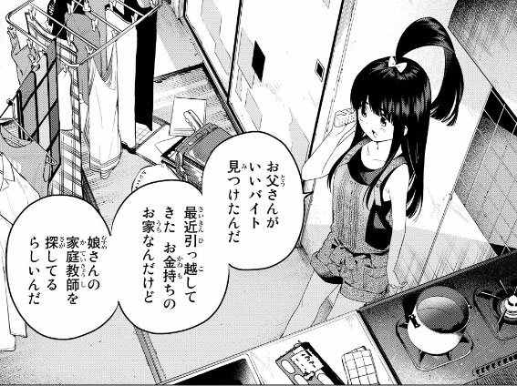
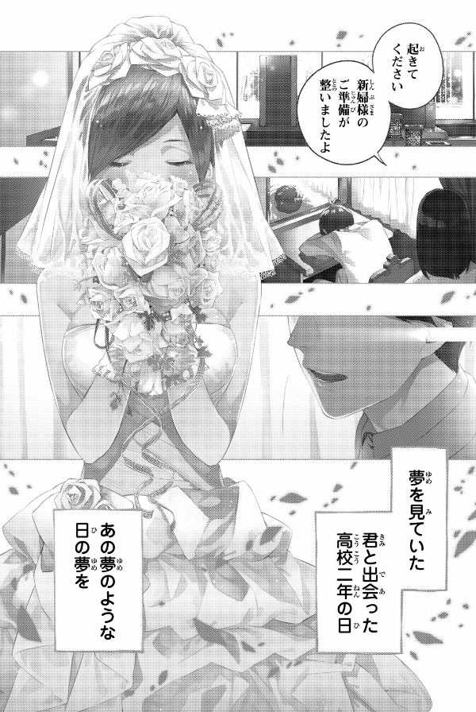
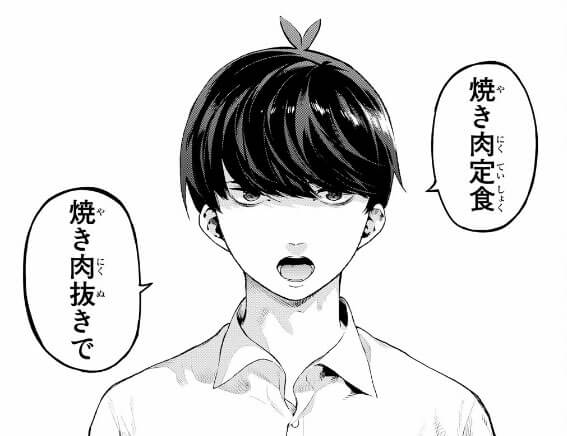
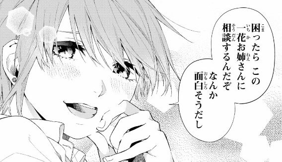
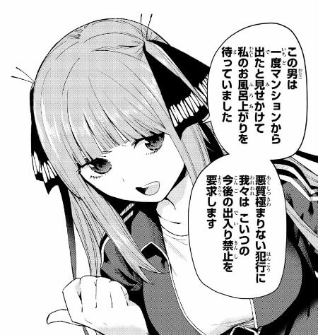
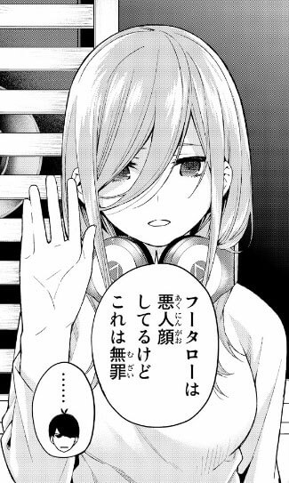
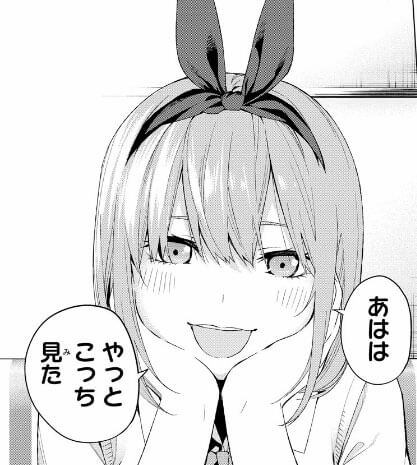
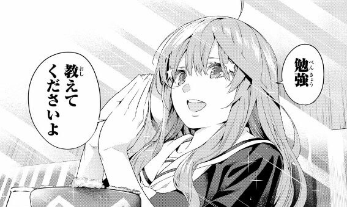
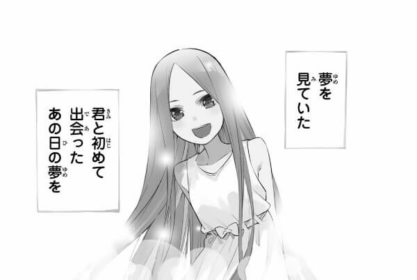

**貴方はどの娘が好み？**

**ヒロインが五つ子という過去に類を見ない設定の新しいラベコメディー漫画！**

週刊少年マガジンで掲載されていた『五等分の花嫁』の面白いところ、登場人文の魅力などを全力で語っていきたいと思う。

僕は連絡当時からマガポケで1話1話購読しており、単行本も（モノクロバージョン）をすべて電子書籍で購入済みです。

**ちなみ作品自体は完結済みなので、これから読み始める人には特におすすめ。**

まぁ……。

…といっても、この作品

**すでに圧倒的人気です。**

アニメ化、作者である春場ねぎ先生の五等分の花嫁展の開催などイベント関係も展開されていてラブコメ、マガジン好きなら知らない人はいないレベル。

正直マガジンのラブコメ代表作といっても過言じゃないです。

こんなブログに来る人なら、「もう知っとるわ！　当たり前だろ！　ふざけてんのかゴルァ！！」の罵られても文句はいえないレベルですが、それでもあえて今回は記事にしようと思う。

今回は、『五等分の花嫁』の下記部分をピックアップしていきます。

*   五等分の花嫁について、まだ読んだことないので知りたい
*   どんな物語で、キャラクターが登場するの？
*   どういった層におすすめの作品なのか
*   今更五等分の花嫁を記事にした理由

五等分の花嫁とは
--------

> 貧乏な生活を送る高校2年生・上杉風太郎のもとに、好条件の家庭教師アルバイトの話が舞い込む。ところが教え子はなんと同級生!!しかも五つ子だった!!全員美少女、だけど「落第寸前」「勉強嫌い」の問題児！最初の課題は姉妹からの信頼を勝ち取ること…!?毎日がお祭り騒ぎ！中野家の五つ子が贈る、かわいさ500％の五人五色ラブコメ開演!!
>
> [五等分の花嫁 マガポケより引用](https://pocket.shonenmagazine.com/episode/13932016480029113185)

### 五つ子の家庭教師として主人公、上杉風太郎が任命される

始まりは上杉風太郎（主人公）が家庭教師の仕事を斡旋されるところから始まります。

風太郎の家庭は裕福ではなく、家族構成は父、妹の3人暮らしで毎月の食費にも切迫している状態でした。

そんな時、風太郎は相場の5倍！という破格な給料の家庭教師のアルバイトを妹づてに紹介されます。

子供の頃からとある事情により人生を勉強のみに費やしていた為、風太郎の学力は学年でトップをキープしていました。

そんな彼にとって、家庭教師の仕事は渡りに船。  
当然風太郎は了承し仕事を引き受けることになります。

生徒が五つ子だとはつゆ知らず……。

### 風太郎に反発するヒロイン達

ヒロインの五つ子は風太郎が家庭教師なことに反対し、まともに勉強しようとしません。

まあ家庭教師の先生が同年代でかつ、男子なので、この反発は当たり前でしょう。

だがしかし風太郎とて仕事で来ているので簡単に諦めるわけにいかない。

ここで

**勉強をさせたい風太郎VS勉強したくない五つ子**

の戦いが開始されます。

この主人公とヒロイン達との関わり合いが序盤の山場になります。

### 花嫁は一人！　最後に風太郎と添い遂げるヒロインは？？

第1話の冒頭の段階で、風太郎は五つ子ヒロインの一人と結婚式をあげます。

**つまり、物語開始時点で風太郎の花嫁は五つ子の誰かで確定しているのです。**

五等分の花嫁のストーリーとは、この風太郎と最終的に添い遂げたヒロインは五つ子の誰なのか？という謎を時系列を追いつつ、考察していくという漫画です。

五等分の花嫁の登場人物・特徴
--------------

### 主人公：上杉風太郎

*   頭いい（学年1位）
*   容姿は普通（作中でイケメン認定はされてない）
*   家族想い
*   運動は苦手

典型的なガリ勉な主人公。

ですがその努力は尋常ではなく、常に学年1位（全教科100点）で、その結果におごらずトイレや食事中、通学の途中でも常に勉強しています。

家庭教師として五つ子と知り合い、まったく勉強せずテストの成績も最低や彼女達を見て、「どうしようもねぇ…」と絶望しつつも、なんとか成績を上げていこうと孤軍奮闘していきます。

### ヒロイン１：中野一花

*   五つ子の長女
*   髪型はショート
*   大人っぽい雰囲気の性格

一花は中野家の長女で五つ子の中で一番妖艶で大人っぽい雰囲気を纏わせています。

綺麗、美人という言葉が似合う娘。

風太郎に対しては面倒見の良いお姉さん風を吹かせながら接することが多く、ときには奥手で鈍感な彼をからかったりします。

しかし、たまに風太郎からドキリとする言動に動揺したりするなど年相応の少女の反応をするギャップの可愛さがあります。

### ヒロイン２：中野二乃

*   五つ子の次女
*   髪型は長髪のツーサイドアップ（物語後編で断髪）
*   かなり気が強く、同時に繊細（ツンデレのツン）
*   姉妹で大好きで、その輪に入ろうとする風太郎に特に反発する。

二乃は五つ子の次女、いわゆるツンデレだが初期はかなりのツン。

普段は社交的で友人も多く、容姿や美醜に気を使い美容グッズや化粧品、服などをたくさん持っていて女子力が高いです。

また姉妹に対する家族愛も五つ子の中で一番深く、姉妹達には恥ずかしがって口にしませんが誰よりも家族を大切に想っています。

ゆえに突然家庭教師としてやってきた風太郎を（睡眠薬で眠らせたりして）妨害したり、なんとか辞めさせようと躍起になります。

序盤では特に棘の深いキャラクターで、風太郎をあの手この手で邪魔をしてくるため、読者からの評判はあまりいいものではありませんでした。

しかし、中盤以降あるきっかけにより彼女は風太郎を認め、自身も勉強に真剣に打ち込むことになります。

そして最後、風太郎にデレはじめた頃の彼女の破壊力は最強です。ここはぜひとも漫画で読んでほしいところです。

### ヒロイン３：中野三玖

*   五つ子の三女
*   セミロングな髪で常にヘッドホンを身に着けている
*   控えめで大人しい性格
*   日本史が好き
*   姉妹の仲で一番勉強できる娘（相対評価）

読者アンケートで圧倒的人気の五つ子の三女三玖。

クールで口数が少なく絡みづらい印象があるが、風太郎のことを初見から名前で呼び、自分の好きな日本史の勉強のみ真面目にやろうとするなど、風太郎との接触をそれほど嫌とは感じていない。

一花、四葉、五月とは仲が良いがニ乃とは服の貸し借りやテレビのチャンネル争いでよく喧嘩をしたりする。

風太郎とは一番最初に和解し、勉強会にもいち早く参加します。

また風太郎に対する好意も序盤から発露しており、自身の自覚していますが根が奥手なのでなかなか自分から積極的にアプローチはできません。

勉強会参加以降は積極的に風太郎に強力して他の姉妹も勉強会に参加させる為に強力してくれます。

### ヒロイン４：中野四葉

*   五つ子の四女
*   セミロングな髪型で特徴的なリボンを巻いている
*   勉強は姉妹仲最下位、しかし運動は一番得意
*   天真爛漫で明るく、最初から風太郎の家庭教師に参加する
*   お人好しな性格で、頼み事をされるとなかなか断れない

四葉は他の姉妹とは違い、最初から風太郎に対して有効的で他の姉妹との間を取り持ったり、勉強会に参加し積極的に取り組みます。

しかし、生来のお人好しな性格が災いし、困っている人を見たり、助けを求められる（主に運動部）とそちらを優先してしまうため結果的に他の姉妹と同じく、勉強会になかなか安定して参加しません。

それ故に、風太郎からの評価は「やる気があって頼りになるが一番の問題児」

### ヒロイン５：中野五月

*   五つ子の末妹
*   長髪ロング＋アホ毛
*   二乃と同じく気が強く風太郎へ反発心も高い
*   誰に対しても丁寧語で話す。
*   一番真面目な性格で勉強もしているが、あまり成果が出ていない。

風太郎と最初に出会ったヒロインが五月です（第一巻でもセンターにいる）。

最初期は五月の方から勉強を教えてほしいと風太郎にお願いしますが、まだ家庭教師の仕事相手が五つ子だと知らない時期だったため、風太郎は面倒くさそうに断ってしまいます。

それが原因で、家庭教師発覚後も風太郎からの勉強会の誘いをすべて断り、口喧嘩もしたりします。

五等分の花嫁のいいところ
------------

**ヒロイン全員が可愛い！（大正義）**

これ、とても大事。**というかすべて。**

ラブコメにありがちな『物語上、特に必要ないけど読者受けを増やすために存在ヒロイン』が存在しない。  
これ、当たり前だと思うかもしれませんが、かなり貴重です。

読者がヒロインを好きになる要素はいろいろありますが、代表的な要素をピックアップするなら以下のようなものがあります。

*   容姿/キャラデザ
*   性格/主人公との関係性
*   物語上での役割

ラブコメならば基本的にキャラデザで好みがあれば、それだけでその漫画を好きになります。

次に性格。  
漫画を読み勧めていくうち、１番好きではなく容姿が琴線にささらなくても、主人公に尽くす系のヒロインだったり、守ってあげたくなるような性格の女の子であれば2番、3番、あるいは最終的には最初に好きだったヒロインを抜いて1番好きになることもあります。

物語上の役割については、例えば不幸な境遇を背負っていたり、物語上のターニングポイントとなるような重要性を持った場合にデザイン、性格を通り抜けてこのキャラが最終的にどうなっていくのか結末を見届けたくなる魅力を感じることもあります。

五等分の花嫁には、これらの3要素があますことなくしっかりと濃縮されて描写されているんです。

ヒロインが5人いるので、最初は特定の一人が気に入って読み進める人が大多数だと思いますが、最終話まで読むと、気づけば**全ヒロインが好きになった！**と思わせてくれるほどに各ヒロインの設定、ストーリーが濃縮されているんです。

### 圧倒的王道ラブコメ！　それぞれ違ってそれぞれいい！

五つ子という他に例のない設定を用いている漫画がですが、それ意外には特にピックアップするような特別の展開は五等分の花嫁にはありません。

**むしろ王道。**

**超！　王道！**

**だがそれがいい！**

変に脇道それず、ラブコメ好きな読者なら誰もが知っているような展開、舞台を圧倒的な画力と物語の持っていきかたで1話1話を描写しています。

### 微妙にミステリ部分もあり考察しがいがった（過去形）

主人公である風太郎には、子供時代にとある少女と出会っています。

その時の出会いと経験が風太郎の現在のアイデンティティを形成しています。

そして、その時の少女とは**五つ子の姉妹の「誰か」**、なのです！

五等分の花嫁はこの、「**過去に風太郎であっていた女の子は五つ子の誰？**」という謎解き展開もあります。

連載当時はこの風太郎と出会っていた五つ子は誰？という考察がネットの海の各地で繰り広げられていました。

### ヒロイン全員が巨乳

> 読み切りを載せた後に一人くらい貧乳がいたほうが良いという意見をいただきましたが見送らせていただきました。これにはきちんとした理由があって僕が大きいほうが良いと思ったからです。
>
> [Twitterより引用](https://twitter.com/negi_haruba/status/977537747949838336?s=20)

すばらしい。ありがとうねぎ先生

貧乳好きは残念ですが出番はありません。南無。

今更五等分の花嫁を記事にした理由
----------------

五等分の花嫁はすでに完結しており、正直今さらこうして紹介記事を書くのは遅すぎるし需要的な面でもほとんとないとおもいます。

それでも、僕が五等分の花嫁について絶対にブログに書きたいと思っていました。

### 僕もブログで『五等分の花嫁』を知りました。

まだ僕がこの漫画を知らない頃、「**[ヤマカム](https://yamakamu.net/)**」という個人ブログで五等分の花嫁を知りました。

そこで試しに単行本を1巻買ってみて、そこからこの漫画にハマり当時5巻まで発売されていた単行本を全巻一気買いしました。

そんな経緯があり、今後が僕がこの漫画を自分のブログで紹介し、昔の僕のような新しい読者を今から一人でも増えてもらえればと思って記事を書きました。

この記事で一人でも新しいファンが生まれ、単行本の売上が上がればそれだけでこの記事を書いたかいが生まれます。

### マガポケから無料で読むことも可能

マガジン本誌ではすでに連絡終了しているので読めませんが、マガポケから白黒、カラーの両方がパソコン、スマホで読めますので少しでも興味があれば下のプリをダウンロード、またはリンクから直接移動して読んでみてください。

最初の数話は無料で読むこともできます。

マガポケ – 人気マンガが毎日楽しめるコミックアプリ

Kodansha Ltd.無料posted with[アプリーチ](https://mama-hack.com/app-reach/ "アプリーチ")

*   [五等分の花嫁（モノクロ　完結済み）](https://pocket.shonenmagazine.com/episode/13932016480029113185)
*   [五等分の花嫁（カラー　連載中）](https://pocket.shonenmagazine.com/episode/10834108156763128496)

### 今後もイベント展開あり

> 
>
> [出典：五等分の花嫁展 MAKEOVE](http://www.gotobun-exhibition.com/index.html)

2020年8月15日に東京で**『五等分の花嫁展』**という展示会が開催されました。

イベント内容は以下のようなものです

*   各ヒロイン別に焦点を当てた場面のコマの展示
*   ヒロインの部屋、服装などを現実に再現した展示
*   会場限定の飲料・グッズの販売

東京はすでに開催が終わっていますが、2020年9月現在ではこれから後に札幌、大阪での開催が発表されています。

なので、今から読み始めても全然遅くなりません。

*   [五等分の花嫁展のHP](http://www.gotobun-exhibition.com/)
*   [五等分の花嫁展Twitter](https://twitter.com/5Hanayome_ten)

### アニメ二期が始まります

2021年1月より、五等分の花嫁の2期アニメが放送されます。

[アニメホームページはこちら](https://www.tbs.co.jp/anime/5hanayome/)。

アニメ1期もDアニメストア会員であれば無料で全話視聴可能です

*   [Dアニメストアはこちら](https://anime.dmkt-sp.jp/animestore/tp_pc)
*   [ニコニコDアニメストアはこちら](https://site.nicovideo.jp/danime/)
*   [amazonプライムでの視聴はこちら](https://www.amazon.co.jp/%E7%AC%AC1%E8%A9%B1-%E4%BA%94%E7%AD%89%E5%88%86%E3%81%AE%E8%8A%B1%E5%AB%81/dp/B07MLXN1G6/ref=as_li_ss_tl?__mk_ja_JP=%E3%82%AB%E3%82%BF%E3%82%AB%E3%83%8A&crid=3H0TXGPCUEW2R&dchild=1&keywords=%E4%BA%94%E7%AD%89%E5%88%86%E3%81%AE%E8%8A%B1%E5%AB%81&qid=1600972205&sprefix=%E4%BA%94%E7%AD%89%E5%88%86,aps,173&sr=8-1&linkCode=ll1&tag=iodein-22&linkId=946bbdb879b07a279125b840cf5d5cfb&language=ja_JP)

まだまだ、五等分の花嫁ワールドは終わっていません。  
カラー版も絶賛連載中なので、僕もファンの一人として最後までこの作品についていきます。

[五等分の花嫁（１） (週刊少年マガジンコミックス)](https://amzn.to/32XTsJW?tag=kenji193-22&linkCode=as1&creative=6339)

created by [Rinker](https://oyakosodate.com/rinker/)

*   [Kindle](https://www.amazon.co.jp/dp/B0764YVB8W?tag=kenji193-22&linkCode=osi&th=1&psc=1)
*   [Amazon](https://amzn.to/32XTsJW?tag=kenji193-22&linkCode=as1&creative=6339)
*   [楽天市場](https://item.rakuten.co.jp/book/15116283/)
