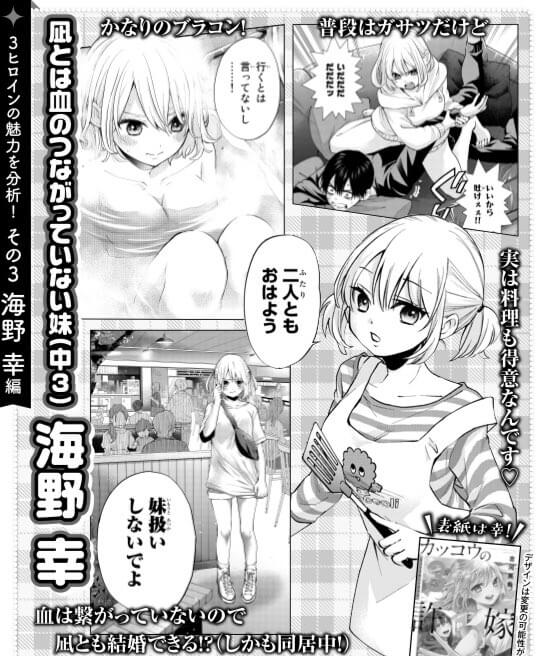

これまで自分の生みの親だと思っていたら実は取り違えられて違う親の元で育てられた……。

それが発覚したのは、子どもが高校生まで成長した時期……。

気がついたが時期すでに遅し…。

**……………そうだ！**

**取り違えた子供同士に結婚してもらえば合法的にお互いの子どもになるじゃん！**

というテーマで始まった新進気鋭のラブコメ。週刊少年マガジン連載中の『カッコウの許嫁』をレビュー・紹介していきたいと思います。  
前回紹介した五等分の花嫁の完結と入れ替わる形で連絡が始まった本作。

↓5等分の花嫁の紹介記事はこちら

[

『五等分の花嫁』完成された最強のラブコメの見どころを一挙解説圧倒的大人気漫画である五等分の花嫁についてあらすじ、登場人物などを紹介します。まだ読んだことのない人、新しいラブコメ作品を探している人に絶対におすすめ。あなたのラブコメ欲求を満たします...

](https://iodein.com/quintessential-quintuplets/)

結論を言おう。

面白い！　可愛い！　素敵！

**アニメ化待ったなし（切望）！！**

*   カッコウの許嫁という漫画とは？
*   登場人物・ヒロインはどんなキャラクター？
*   魅力的なところ部分はどこ？
*   無料で読めるところはある？

上記内容をピックアップして、ラブコメ大好き漫画先生の僕がこの漫画の魅力・良かったところを紹介します。

カッコウの許嫁のあらすじ、概要
---------------

> 赤ちゃんの頃に取り違えられ、今は名門私立に通う高校 2年の海野凪。ある日、これから許嫁に会いにいくという超お嬢様女子高生・天野エリカと偶然出会い、彼氏のフリをしてくれと半ば強引に頼まれてしまう。だが、その時の二人は知る由もなかった。エリカは凪と取り違えられた子どもで、凪はエリカの許嫁相手だということを——。「取り違え子」から始まる人生交錯ラブコメ開幕！
>
> [カッコウの許嫁 – 吉河美希 / 【1羽目】私の彼氏になりなさいよ！ | マガジンポケット](https://pocket.shonenmagazine.com/episode/10834108156750307901)

作者：吉河美希

### 出会いは偶然。運命は必然　主人公とヒロインは邂逅する。

物語は主人公とヒロインがこの世に生を受けた瞬間から始まります。

2人は同じ病院で生まれますが、病院側の手違いによりそれぞれ産みの親とは別の人間の元へ引き渡されてしまい、実の両親とは別の環境の元で育てられてしまいます。

それが事実として発覚したのは生まれてから16年後、すでに2人が高校生になった時期でした。

驚愕の自体に気がついた主人公とヒロインの両親は、お互い取り違えられた子どもに対面するための場を設けます。

作中の登場人物、ヒロイン
------------

### 天野 エリカ

> 
>
> [カッコウの許嫁【公式】 @wmagacuckoo](https://twitter.com/wmagacuckoo)

*   メインヒロイン
*   ツインテール
*   親がお金持ちのお嬢様
*   巨乳その1
*   勉強苦手でテストの点は低い
*   コスプレ好きで各話でいろんな衣装に変身します

### 海野 幸

> 
>
> [カッコウの許嫁【公式】 @wmagacuckoo](https://twitter.com/wmagacuckoo)

*   ボブカット
*   義妹
*   ブラコン入ってる（お兄ちゃん大好き、が素直になれない）
*   巨乳（遺伝…？）その2

### 瀬川 ひろ

> 
>
> [カッコウの許嫁【公式】 @wmagacuckoo](https://twitter.com/wmagacuckoo)

*   ゆるふわパーマのボブヘア
*   学年1位の実力の学力を持ち、運動神経も抜群
*   モテる。…が自分より頭のいい人が好み。を公言しており誰も告れない。
*   巨乳その3

### 海野 凪（主人公）

> 
>
> [カッコウの許嫁【公式】 @wmagacuckoo](https://twitter.com/wmagacuckoo)

*   頭脳明晰でテストの成績は常に上位
*   喧嘩強く拳を人をふっとばしたりする
*   負けず嫌いでテストの結果が万年2位であることを気にしている
*   テストの成績で1位をとり瀬川ひろに告白することを目標としている。

カッコウの花嫁の面白いところ、魅力的な部分
---------------------

### 圧倒的ヒロイン力！　可愛いという暴力で殴りつける

> 
>
> [カッコウの許嫁【公式】 @wmagacuckoo](https://twitter.com/wmagacuckoo)

**ラブコメはヒロインが可愛いかどうかがすべてだ！！！**

**ラブコメなんてヒロインが可愛けりゃストーリーなんてどうでもいいんだよ！**

そう思っているそこの君へ。  
今すぐ近くの書店に行くか、amazonで単行本、電子書籍をポチるが良い。  
大丈夫。絶対後悔しないから。

主人公の凪とメインヒロインのエリカは双方とも親の事情（というかエリカ側の親の都合）に振り回され、お互いに結婚する気など毛頭ありません。

このあたりはニセコイの導入部に近いかと思われます。  
あちらの漫画も両親の都合でニセの恋人を演じるという、カッコウの許嫁の序章と似ています。

ストーリーとしての起伏は基本的には薄味。ですがヒロインの可愛さは超濃い。

照れ、怒り、泣き、驚き、笑い。全部が美麗な作画で表現されていて毎話毎話でヒロインがキラッと光るような表情、ポーズ、仕草を魅せてくれます。

**物語とかとりあえずいいからとにかくヒロインの可愛い姿みたい！**

そんな希望を持っている貴方に超おすすめ。日々に癒やしにどうぞ一杯

### 着地点は順当にメインヒロインor想い人との恋愛か、はてまた兄妹での禁断の愛か…

> 
>
> [カッコウの許嫁【公式】 @wmagacuckoo](https://twitter.com/wmagacuckoo)

カッコウの許嫁は記事執筆時（2020年10月）では既刊3巻で、お話の展開としては起承転結の『承』です。

*   主人公とヒロインの邂逅
*   ヒロイン同士の邂逅
*   それぞれの関係性の構築と変化
*   主人公と各ヒロインとの親密度の上昇

上記4点の部分が順調に消化されていますが、まだ『転』に至るところには全然至っていません。

昨今、ラブコメ漫画は必ずメインヒロインと結ばれる。という王道の牙城を崩していくところが増えています（五等分の花嫁とか）。

なのでエリカがメインヒロインだからエリカとくっついてEND！とは断言することができません。

そして、カッコウの許嫁のストーリーはエリカはもちろんですが、妹である幸に焦点を当てたシナリオが比較的多いような印象を受けました。

公式のTwitterでもこんなことつぶやいています

つまり今後は話の機動を90度曲げて義妹との禁断の恋に恋にフォーカスする可能性も十二分に存在します！

僕としてはどっちのヒロインも好きなのでどちらに行っても大歓迎。

### ひろだけちょっと印象薄……？

取り違えっ子という土台の都合上、まったくメインのお話に絡まないひろだけはちょっと印象が薄く感じられます。

ひろのような最初から主人公に好かれているキャラクターは結果的に不遇になりがち。

なんやかんやあって最終的には主人公にお断りされる不憫な立ち位置担ってしまうことが多い（ニセコイの小野寺さんとか…）ので、その予想裏切ってくれることを少し期待してたりします。

ようするに、どう転んでもいいんだ！

でも主人公がクソキャラ化するのだけは勘弁な！！

それだけはマジで萎えるから！！

売れ行き絶好調 アニメ化されるでしょこれは…
----------------------

> 
>
> [カッコウの許嫁【公式】 @wmagacuckoo](https://twitter.com/wmagacuckoo)

カッコウの花嫁は6月29日の5刷で累計発行部数が約10万部を記録しました。

これは高確率でアニメされるでしょ（予言）

今すぐ無料で読めるアプリ、サイト
----------------

*   [カッコウの許嫁 – 吉河美希 / 【1羽目】私の彼氏になりなさいよ！ | マガジンポケット](https://pocket.shonenmagazine.com/episode/10834108156750307901)
*   [カッコウの許嫁 – pixivコミック](https://comic.pixiv.net/works/6517)

[カッコウの許嫁（１） (週刊少年マガジンコミックス)](https://www.amazon.co.jp/dp/B087Q5HY7T?tag=kenji193-22&linkCode=osi&th=1&psc=1)

*   [Kindle](https://www.amazon.co.jp/dp/B087Q5HY7T?tag=kenji193-22&linkCode=osi&th=1&psc=1)
*   [Amazon](https://www.amazon.co.jp/dp/B087Q5HY7T?tag=kenji193-22&linkCode=osi&th=1&psc=1)
*   [楽天市場](https://hb.afl.rakuten.co.jp/hgc/1cf903e0.225496a9.1cf903e1.49087201/
