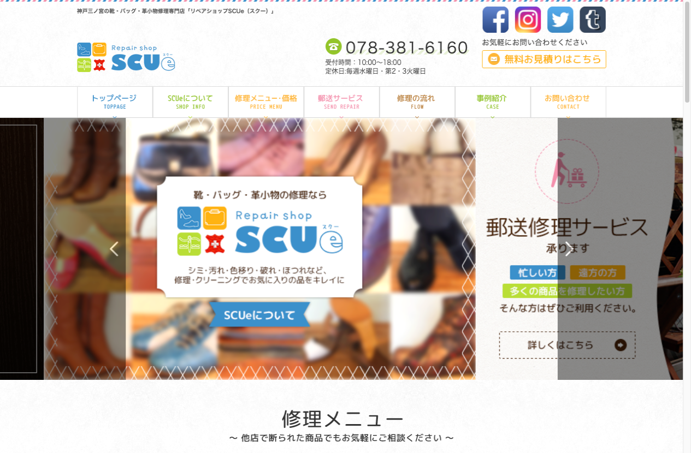
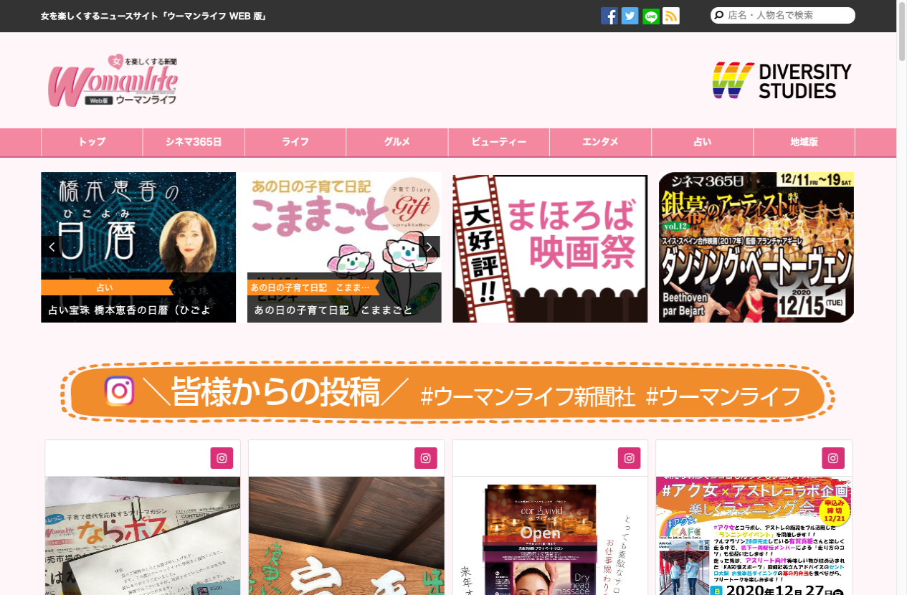
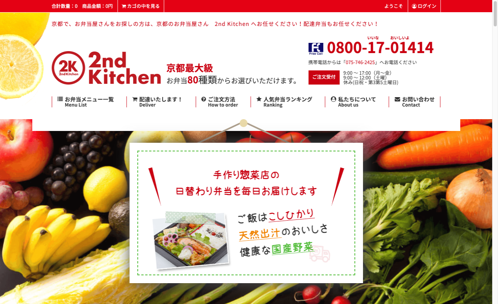
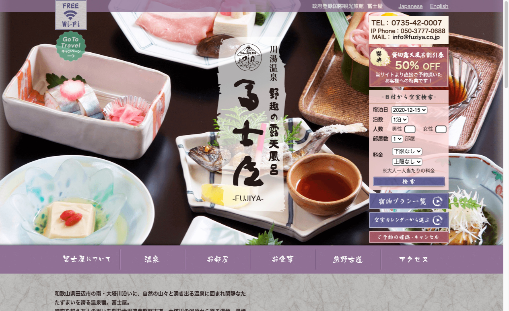
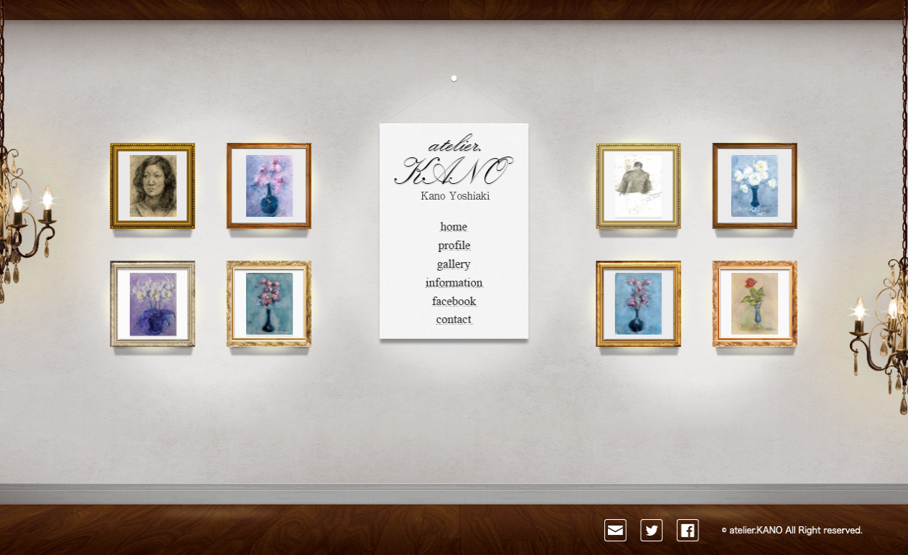
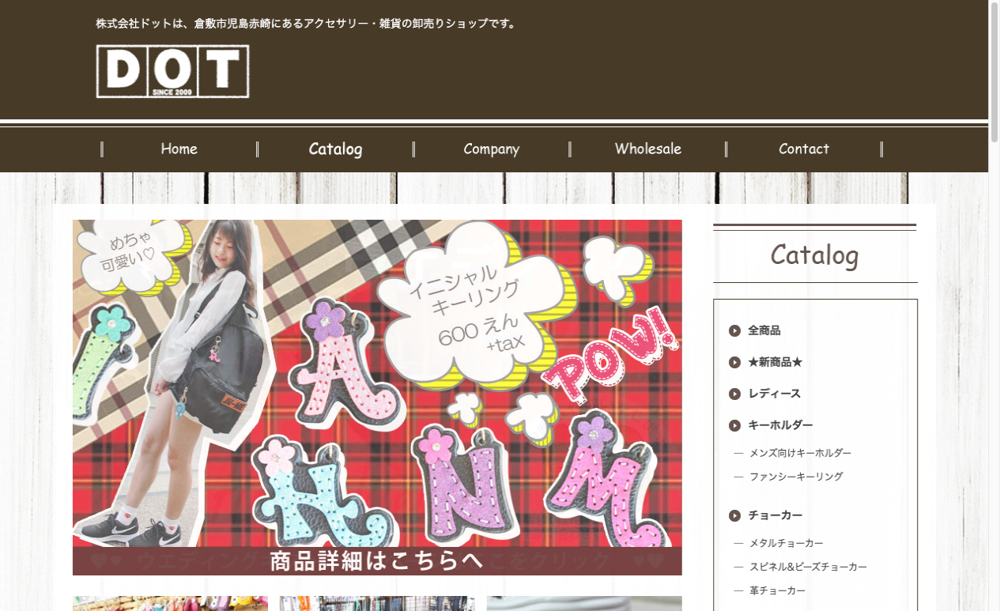
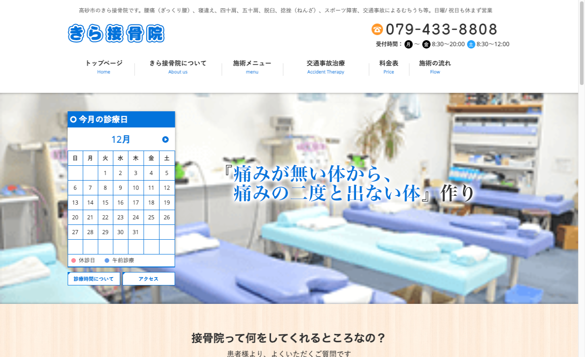

## リペアショップScue

### プロジェクト概要
- 新規サイト制作
- 全体規模：2ヶ月程度
- デザイン制作：1週間
- コーディング：1週間

### 担当フェーズ
- サイト構築
- 下層ページデザイン
- コーディング

### 言語/FW
- HTML5
- CSS3
- javaScript(jQuery)

## ウーマンライフ新聞社

### プロジェクト概要
- 既存サイトのリニューアル
- 全体規模：3ヶ月程度
- デザイン制作：4週間
- コーディング：4週間

### 担当フェーズ
- 下層ページデザイン
- コーディング
- CMS組込

### 言語/FW
- HTML5
- CSS3
- javaScript(jQuery)
- PHP
- WordPress

## セカンドキッチン

### プロジェクト概要
- 既存サイトのリニューアル
- （ショッピング機能（ECCUBE））
- （ブログ・メディア（WordPress））
- 全体規模：3ヶ月程度							
- デザイン制作：3週間							
- コーディング：4週間

### 担当フェーズ
- トップページデザイン
- 下層ページデザイン
- コーディング
- CMS組込

### 言語/FW
- HTML5
- CSS3
- javaScript(jQuery)
- PHP
- WordPress
- ECCUBE		

## 富士屋
[																					](http://www.fuziya.co.jp/)
### プロジェクト概要
- 既存サイトのリニューアル
- 全体規模：2ヶ月程度					
- デザイン制作：2週間							
- コーディング：2週間

### 担当フェーズ
- 下層ページデザイン
- コーディング

### 言語/FW
- HTML5
- CSS3
- javaScript(jQuery)
- PHP

## アトリエ・カノ
																								
### プロジェクト概要
- 新規サイト制作
- 全体規模：2ヶ月程度							
- コーディング：2週間

### 担当フェーズ
- 全ページコーディング

### 言語/FW
- HTML5
- CSS3
- javaScript(jQuery)
- PHP

## ドット

### プロジェクト概要
- 既存サイトのリニューアル
- 全体規模：2ヶ月程度
- コーディング：3週間

### 担当フェーズ
- 全ページコーディング

### 言語/FW
- HTML5
- CSS3
- javaScript(jQuery)
- PHP
- ECCUBE

## きら接骨院

### プロジェクト概要
- 新規サイト制作
- 全体規模：2ヶ月程度							
- コーディング：3週間

### 担当フェーズ
- 全ページコーディング

### 言語/FW
- HTML5
- CSS3(Sass)
- javaScript(jQuery)
- Node.js(gulp)
